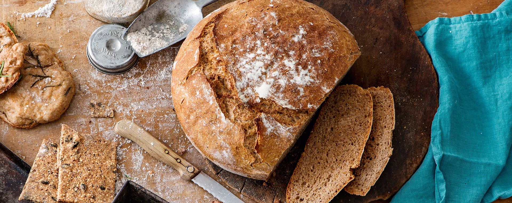

# Bauernbrot

## Overview

3:10 Stunden + Sauerteig 

## Zutaten

- 10g Frische Backhefe
- 300g Weizen-Vollkornmehl
- 150g Weizenmehl 550
- 60 Dinkelmehl 630
- 50-70g Sauerteig Vollkorn-Roggen
- 10g Salz
- (Leinsamen und sonstiges/Gewürze nach Belieben)

## Zubereitung

*Geht auch ohne Topf im Ofen, wird dann evtl. etwas breiter*

1. Backhefe in 400 ml lauwarmem Wasser auflösen.
2. Die verschiedenen Mehlsorten, Sauerteig und das Wasser-Hefe-Gemisch 5 Minuten mit Handrührgerät verkneten. 20 Minuten ruhen lassen.
3. Salz dazugeben und 5 Minuten kneten, bis sich der Teig leicht vom Schüsselrand lösen lässt.
4. 1 Stunde gehen lassen: dabei alle 15 Minuten mit einem Teigschaber zur Mitte falten (so kommt mehr Luft in den Teig).
5. Ein Tuch in eine große Schüssel legen und auf dem Boden etwas bemehlen. Den Teig auf bemehlter Fläche mit leicht feuchten Händen alle vier Seiten von außen nach innen falten. Mit der Verschlussnaht nach oben in die ausgekleidete Schüssel legen. 30 Minuten abgedeckt gehen lassen.
6. Ofen auf 250°C vorheizen mit Ober/Unterhitze.
7. Teig auf ein Backbleck mit Backpapier stürzen. Oben mit Wasser befeuchten und Kreuz reinschneiden. Anschließend in den Ofen legen.
8. Nach 10-15 Minuten auf 200°C runter drehen und weitere 20-30 Minuten gehen lassen. Das Brot ist fertig, sobald der Boden beim Klopfen hohl klingt.

